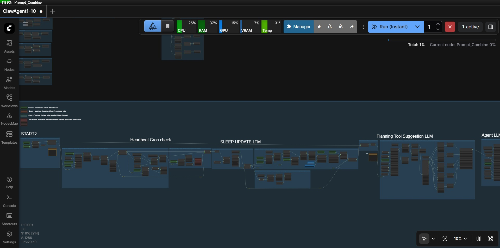

# ComfyClaw

ComfyClaw is a ComfyUI custom node pack and prototype agent harness for building visible, inspectable agent workflows.

Most agent systems hide their loop inside code. ComfyClaw moves that loop into a ComfyUI workflow so you can see the heartbeat, prompt assembly, tool selection, tool execution, chat handoff, short-term memory, long-term memory, and safety checks as separate pieces.

It is meant for learning, experimenting, and prototyping. Once a workflow shape feels right, you can move the same design into faster application code.



## What You Get

- **ComfyUI nodes** for text routing, JSON/YAML manipulation, files, LLM calls, embeddings, MCP calls, timers, tool calls, and persistent command execution.
- **An agent workspace** with prompt files, memory files, heartbeat state, user message files, and tool descriptions.
- **A CLI tool runner** that can be called by ComfyUI, another agent harness, or a human operator.
- **A local chat bridge** that reads and writes the agent message files.
- **An example workflow** showing how the pieces can be wired together.

## Current Status

ComfyClaw is early prototype software. The custom nodes and tools are usable, and the example agent workflow demonstrates the intended architecture, but it is not trying to be a cutting-edge agent.

The main limitation is the LLM's ability to follow strict tool-call instructions. Current models can still call tools in the wrong format, choose awkward actions, or drift away from the expected schema. ComfyUI also makes the loop slower than a purpose-built code harness.

The point of ComfyClaw is to let people explore agentic concepts and test workflow ideas without building an entire agent system from scratch. It is a visible workbench first, and a production agent second.

## Quick Start

Clone this repository into ComfyUI `custom_nodes`:

```powershell
cd C:\ComfyUI\ComfyUI\custom_nodes
git clone https://github.com/Steven-Hammon/ComfyClaw.git
cd ComfyClaw
pip install -r requirements.txt
```

Restart ComfyUI after installation.

The repository root includes `__init__.py` because ComfyUI imports custom node folders from the immediate `custom_nodes` directory. That root entrypoint loads the node package from `ComfyClaw-Nodes/` and exposes the web assets from `ComfyClaw-Nodes/web`.

When running the agent workflow, use ComfyUI's queue mode dropdown. Set it to **Instant Queue** when you want the workflow to keep cycling automatically, and switch it back to **Run** when you want normal one-shot/manual execution.

## Tool Setup

The tools use their own virtual environment so their dependencies stay separate from ComfyUI:

```powershell
cd C:\ComfyUI\ComfyUI\custom_nodes\ComfyClaw\ComfyClaw-Tools
setup.bat
```

The tool runner can also be used without ComfyUI:

```powershell
python run_tool.py FILE-TREE "--path . --depth 2"
python run_tool.py FETCH-GET "--url https://example.com"
```

See `ComfyClaw-Tools/README.md` and `ComfyClaw-Tools/TOOLS.md` for the full tool list.

## Model Setup

ComfyClaw-Agent expects Ollama to be installed and running. Download the model and embedding model you want to use, for example:

```powershell
ollama run gemma4:e4b
ollama pull qwen3-embedding
```

The example workflow was designed around a large local context window. If your GPU has less VRAM, reduce the Ollama context window in your Ollama settings and update the model values in the workflow's model setup section.

## Default Paths

The default agent root path is:

```text
C:\ComfyUI\ComfyUI\custom_nodes\ComfyClaw\ComfyClaw-Agent\
```

If you install ComfyClaw somewhere else, update these six path locations:

1. In the ComfyClaw workflow, set the root directory of your `ComfyClaw-Agent` folder.
2. In the workflow's Get Folder Paths group, update `Path_ALLOWED_DIRECTORY`.
3. In the same workflow group, update `Path_CLI_TOOLS`.
4. In `ComfyClaw-Chat/chat_settings.json`, update `download_dir`.
5. In `ComfyClaw-Chat/chat_settings.json`, update `chat_to_agent_file`.
6. In `ComfyClaw-Chat/chat_settings.json`, update `agent_to_chat_file`.

Only the ComfyUI node package needs to be importable by ComfyUI. The agent folder, tools folder, and chat folder can live elsewhere as long as the workflow and chat settings point to the right paths.

## Repository Layout

```text
ComfyClaw/
|-- __init__.py
|-- README.md
|-- requirements.txt
|-- ComfyClaw-Agent/
|   |-- prompts/
|   |-- Workspace/
|   |-- HEARTBEAT.json
|   |-- LAST_RESPONSES.json
|   |-- LTM.json
|   |-- STM.json
|   |-- TOOLS.json
|-- ComfyClaw-Chat/
|   |-- chat_service.py
|   |-- chat_settings.json
|   |-- run_chat_service.bat
|-- ComfyClaw-Nodes/
|   |-- __init__.py
|   |-- docs/
|   |-- example_workflow/
|   |-- web/
|-- ComfyClaw-Tools/
|   |-- run_tool.py
|   |-- setup.bat
|   |-- tools/
```

## Main Pieces

- `ComfyClaw-Nodes` contains the ComfyUI custom nodes.
- `ComfyClaw-Agent` contains prompts, memory files, heartbeat state, workspace files, and tool descriptions.
- `ComfyClaw-Tools` contains the CLI runner and tool modules for browser, fetch, file, search, PDF, RAG, and MCP actions.
- `ComfyClaw-Chat` contains a simple local chat bridge that reads from and writes to the agent message files.

The example workflow is in `ComfyClaw-Nodes/example_workflow/`.

## How The Agent Loop Works

At a high level, the workflow builds context, decides what kind of cycle is needed, asks the model what to do next, validates the requested action, runs a tool if allowed, and then compresses the result into memory.

The loop is split into visible stages:

1. Load the current user message, heartbeat request, memory state, paths, prompts, and model settings.
2. Decide whether to respond immediately or perform background maintenance.
3. Use a planning step to suggest a small set of relevant tools.
4. Ask the main model to send a message, search memory, sleep, run a command, or call a tool.
5. Run prompt-injection and tool-call safety checks before executing external actions.
6. Append the new response to `LAST_RESPONSES`.
7. Compress older responses into short-term memory, then into long-term memory when needed.

For loop-style testing, set ComfyUI to **Instant Queue**. For normal manual testing, switch the dropdown back to **Run**.

For the deeper design walkthrough, read `ComfyClaw_Explanation.md`.

## Node Validation

From the node folder:

```powershell
cd C:\ComfyUI\ComfyUI\custom_nodes\ComfyClaw\ComfyClaw-Nodes
python -m unittest -v test_comfyclaw.py
```

You can also smoke-test the root ComfyUI entrypoint from the repository root:

```powershell
python -c "import importlib.util, pathlib, sys; root=pathlib.Path('.').resolve(); spec=importlib.util.spec_from_file_location('ComfyClaw', root / '__init__.py', submodule_search_locations=[str(root)]); mod=importlib.util.module_from_spec(spec); sys.modules['ComfyClaw']=mod; spec.loader.exec_module(mod); print(len(mod.NODE_CLASS_MAPPINGS), mod.WEB_DIRECTORY)"
```

## License

Apache License 2.0. See `LICENSE`.
